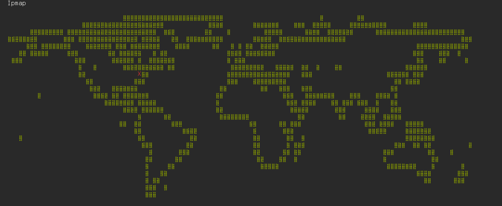

<pre>
                         ####################################################
                         #  _      ___  ___                     __   _____  #
                         # (_)     |  \/  |                    /  | |  _  | #
                         #  _ _ __ | .  . | __ _ _ __   __   __`| | | |/' | #
                         # | | '_ \| |\/| |/ _` | '_ \  \ \ / / | | |  /| | #
                         # | | |_) | |  | | (_| | |_) |  \ V / _| |_\ |_/ / #
                         # |_| .__/\_|  |_/\__,_| .__/    \_/  \___(_)___/  #
                         #   | |                | |                         #
                         #   |_|                |_|                         #
                         #                                                  #
                         ####################################################
                         ##### by totor59 ~~ https://github.com/totor59 #####
                         ####################################################
</pre>

## Preview

## Install
`
sudo apt-get update
sudo apt-get install nodejs npm
cd ipMap 
npm install

## Sources
For the world map : [https://github.com/yaronn/blessed-contrib](https://github.com/yaronn/blessed-contrib)
Blessed : [https://github.com/chjj/blessed](https://github.com/chjj/blessed)
